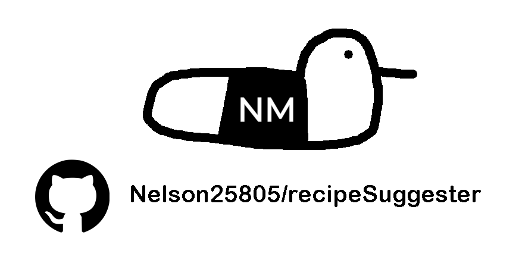

<a id="readme-top"></a>

<!-- PROJECT SHIELDS -->
<!--
*** I'm using markdown "reference style" links for readability.
-->
[![Contributors][contributors-shield]][contributors-url]
[![Forks][forks-shield]][forks-url]
[![Stargazers][stars-shield]][stars-url]
[![Issues][issues-shield]][issues-url]
[![project_license][license-shield]][license-url]
[![LinkedIn][linkedin-shield]][linkedin-url]

<!-- PROJECT LOGO -->
<br />
<div align="center">
  <a href="https://github.com/Nelson25805/recipeSuggester">
    
  </a>

<h3 align="center">Recipe Suggester</h3>

  <p align="center">
    A simple desktop application for downloading YouTube videos or audio files.
    <br />
    <a href="https://github.com/Nelson25805/recipeSuggester"><strong>Explore the docs »</strong></a>
    <br />
    <br />
    <a href="https://github.com/Nelson25805/recipeSuggester">View Demo</a>
    &middot;
    <a href="https://github.com/Nelson25805/recipeSuggester/issues/new?labels=bug">Report Bug</a>
    &middot;
    <a href="https://github.com/Nelson25805/recipeSuggester/issues/new?labels=enhancement">Request Feature</a>
  </p>
</div>

<!-- TABLE OF CONTENTS -->
<details>
  <summary>Table of Contents</summary>
  <ol>
    <li>
      <a href="#about-the-project">About The Project</a>
      <ul>
        <li><a href="#built-with">Built With</a></li>
      </ul>
    </li>
    <li>
      <a href="#getting-started">Getting Started</a>
      <ul>
        <li><a href="#installation">Installation</a></li>
      </ul>
    </li>
    <li><a href="#usage">Usage</a></li>
    <li><a href="#contributing">Contributing</a></li>
    <li><a href="#license">License</a></li>
    <li><a href="#contact">Contact</a></li>
  </ol>
</details>


<!-- ABOUT THE PROJECT -->
## About The Project

![Project Name Screen Shot][project-screenshot]

The **Python YouTube Downloader** is a lightweight desktop application that allows users to download YouTube content as either video (MP4) or audio (MP3) files through a simple graphical interface.

Built using **Tkinter** and **yt-dlp**, the application focuses on ease of use while providing reliable media downloading and automatic format conversion.

### Key features
- 🎬 Download YouTube videos in MP4 format.
- 🎵 Extract audio and convert directly to MP3.
- 📁 Choose custom download destination folders.
- ⚡ Background threaded downloads (UI stays responsive).
- 🔄 Automatic FFmpeg integration for merging and conversion.
- 🖥️ Simple cross-platform desktop GUI.

This project is intended for educational and personal use, demonstrating GUI development, threading, and media processing in Python.

<p align="right">(<a href="#readme-top">back to top</a>)</p>


## Built With

| Badge | Description |
|:-----:|-------------|
| [][Python-url] | Core programming language. |
| [][Tkinter-url] | Desktop GUI framework. |
| [][ytdlp-url] | Media downloading engine. |
| [][ffmpeg-url] | Audio/video processing and conversion. |


<p align="right">(<a href="#readme-top">back to top</a>)</p>


<!-- GETTING STARTED -->
## Getting Started

You can run the application in two ways:

1) Run the packaged executable (.exe)  
2) Run the Python script manually

## Installation

1. Clone the repo
   ```sh
   git clone https://github.com/Nelson25805/recipeSuggester.git
If using the executable version, skip to Step 6.
Install Python:
https://www.python.org/downloads/

Install required dependencies:

pip install -r requirements.txt
Install FFmpeg and ensure it is added to your system PATH:
https://ffmpeg.org/download.html

Run the application:

python main.py
<p align="right">(<a href="#readme-top">back to top</a>)</p> <!-- USAGE -->
Usage
Main Downloader Window

Paste a YouTube URL.
Select a destination folder.
Choose output format (MP3 or MP4).
Click Download.

The application will automatically download and convert the media.

Audio Conversion (MP3)

When MP3 is selected:

Audio is extracted using yt-dlp.
FFmpeg converts the file automatically to MP3 format.
<p align="right">(<a href="#readme-top">back to top</a>)</p> <!-- CONTRIBUTING -->

## Contributing

Contributions are what make the open source community such an amazing place to learn and create. Any contributions you make are greatly appreciated.

Fork the Project
Create your Feature Branch (git checkout -b feature/AmazingFeature)
Commit your Changes (git commit -m 'Add some AmazingFeature')
Push to the Branch (git push origin feature/AmazingFeature)
Open a Pull Request
<p align="right">(<a href="#readme-top">back to top</a>)</p>

## Top contributors:

<a href="https://github.com/Nelson25805/passwordManager/graphs/contributors">
  
</a>

License

Distributed under the project_license. See LICENSE.txt for more information.

<p align="right">(<a href="#readme-top">back to top</a>)</p> <!-- CONTACT -->
Contact

Nelson McFadyen - Nelson25805@hotmail.com

Project Link: https://github.com/Nelson25805/youtube-downloader

<p align="right">(<a href="#readme-top">back to top</a>)</p> <!-- MARKDOWN LINKS -->


<!-- MARKDOWN LINKS & IMAGES -->
<!-- https://www.markdownguide.org/basic-syntax/#reference-style-links -->
[contributors-shield]: https://img.shields.io/github/contributors/Nelson25805/passwordManager.svg?style=for-the-badge
[contributors-url]: https://github.com/Nelson25805/passwordManager/graphs/contributors
[forks-shield]: https://img.shields.io/github/forks/Nelson25805/passwordManager.svg?style=for-the-badge
[forks-url]: https://github.com/Nelson25805/passwordManager/network/members
[stars-shield]: https://img.shields.io/github/stars/Nelson25805/passwordManager.svg?style=for-the-badge
[stars-url]: https://github.com/Nelson25805/passwordManager/stargazers
[issues-shield]: https://img.shields.io/github/issues/Nelson25805/passwordManager.svg?style=for-the-badge
[issues-url]: https://github.com/Nelson25805/passwordManager/issues
[license-shield]: https://img.shields.io/github/license/Nelson25805/passwordManager.svg?style=for-the-badge
[license-url]: https://github.com/Nelson25805/passwordManager/blob/master/LICENSE.txt
[linkedin-shield]: https://img.shields.io/badge/-LinkedIn-black.svg?style=for-the-badge&logo=linkedin&colorB=555
[linkedin-url]: https://www.linkedin.com/in/nelson-mcfadyen-806134133/

[project-Image]: GithubImages/projectImage.png

[project-screenshot]: GithubImages/mainScreen.png
[project-screenshot2]: GithubImages/filteredGameSearch.gif
[project-screenshot3]: GithubImages/randomGameSearch.gif

[project-screenshot4]: GithubImages/excelExample.png
[project-screenshot5]: GithubImages/envExample.png


[Ruby-url]: https://www.ruby-lang.org/en/downloads/
[GTK3-url]: https://www.gtk.org/
[SQLite3-url]: https://www.sqlite.org/download.html
[OpenSSL-url]: https://openssl-library.org/source/
[Bcrypt-url]: https://rubygems.org/gems/bcrypt/versions/3.1.12?locale=en

[Python]: https://img.shields.io/badge/python-3670A0?style=for-the-badge&logo=python&logoColor=ffdd54
[Tkinter]: https://img.shields.io/badge/Tkinter-8.6-green
[JQuery.com]: https://img.shields.io/badge/jQuery-0769AD?style=for-the-badge&logo=jquery&logoColor=white


